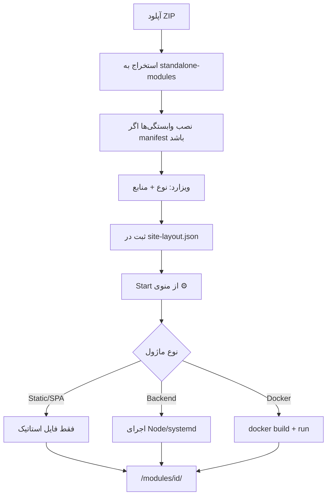

<style>
body, p, h1, h2, h3, h4, h5, h6, li, ul, ol {
  font-family: 'Segoe UI', Segoe, Tahoma, Geneva, Verdana, sans-serif !important;
  direction: rtl;
  text-align: right;
}
pre, code {
  direction: ltr;
  text-align: left;
}
table {
  direction: rtl !important;
  text-align: right !important;
  width: 100%;
  border-collapse: collapse;
}
table th, table td {
  text-align: right !important;
  direction: rtl;
  vertical-align: top;
  padding: 0.35em 0.5em;
}
table td code, table th code {
  direction: ltr;
  unicode-bidi: embed;
  display: inline-block;
}
</style>

بر اساس کد پروژه، **نوع جداگانه‌ای به اسم SPA در سیستم ثبت نمی‌شود**. سه نوع اصلی داریم: **Static**، **Backend** و **Docker**. SPA در عمل همان Static است که فایل `index.html` دارد و مسیریابی سمت کلاینت دارد.

---

## جریان مشترک (برای همه انواع)

همه ماژول‌ها از یک مسیر واحد اضافه می‌شوند:

### ۱. آپلود ZIP
- Super Admin روی «افزودن محتوا» → «آپلود ZIP» می‌زند.
- فایل به `POST /admin/upload` می‌رود.
- سرور یک `moduleId` مثل `mod-a1b2c3` می‌سازد.
- ZIP داخل `standalone-modules/<moduleId>/` استخراج می‌شود.
- اگر `package.json`، `requirements.txt` یا `composer.json` باشد، وابستگی‌ها نصب می‌شوند (با کش مشترک).

### ۲. ویزارد (دو مرحله)
**مرحله ۱ — نوع اجرا:**
- تیک Docker
- تیک «نیاز به پروسه»
- پورت (خالی = خودکار بین ۴۱۰۰–۴۹۹۹)
- دسترسی‌ها (`network` و...)

**مرحله ۲ — ظاهر و منابع:**
- نام، توضیحات، آیکون
- محدودیت CPU / RAM / Swap

### ۳. ثبت در layout
- `POST /admin/wizard/save` اطلاعات را در `storage/site-layout.json` ذخیره می‌کند.
- یک نود کارت در درخت پوشه‌ها اضافه می‌شود.
- وضعیت اولیه: **stopped**

### ۴. استارت و دسترسی
- از منوی ⚙ روی کارت → **Start**
- کاربر روی کارت کلیک می‌کند → `/modules/<moduleId>/`

---

## تشخیص نوع در کد

```9:16:D:/2 Curent project git/ModuleHub-cms/core/src/modules/module-manager/module-classifier.ts
export function classifyModuleHosting(entry: ModuleEntry): ModuleHostingKind {
  if (entry.docker) {
    return 'docker';
  }
  if (entry.port > 0) {
    return 'backend';
  }
  return 'static';
}
```

| نوع | تنظیمات ویزارد | `port` | `docker` |
|-----|----------------|--------|----------|
| **Static** | «نیاز به پروسه» خاموش | `0` | `false` |
| **Backend** | «نیاز به پروسه» روشن، Docker خاموش | `> 0` | `false` |
| **Docker** | Docker روشن | `> 0` | `true` |

---

## ۱. ماژول Static (HTML ساده)

### چه چیزی داخل ZIP باشد؟
- فایل‌های آماده: `index.html`، CSS، JS، تصاویر
- معمولاً `index.html` در ریشه ZIP

### مراحل
1. ZIP آپلود
2. ویزارد: **«نیاز به پروسه» خاموش** → `port = 0`
3. ثبت و **Start**
4. باز کردن `/modules/<moduleId>/`

### بعد از Start چه می‌شود؟
- **هیچ پروسه پس‌زمینه‌ای اجرا نمی‌شود**؛ فقط وضعیت `running` می‌شود.
- Express فایل‌ها را مستقیم از پوشه ماژول سرو می‌کند.

### مثال
ZIP شامل:
```
index.html
style.css
app.js
```

---

## ۲. ماژول SPA (React / Vue / Angular)

### نکته مهم
SPA **نوع جدا نیست**؛ همان Static است با رفتار fallback.

### چه چیزی داخل ZIP باشد؟
- خروجی build (مثلاً `dist/`) — محتوا در **ریشه ZIP**، نه داخل پوشه `dist`
- حتماً `index.html` در ریشه

### مراحل
1. پروژه را build کنید (`npm run build`)
2. محتوای `dist/` را ZIP کنید
3. ویزارد: **«نیاز به پروسه» خاموش**
4. Start و باز کردن `/modules/<moduleId>/`

### رفتار مسیریابی
اگر کاربر برود به `/modules/mod-xxx/app/dashboard` و فایلی با آن نام نباشد، سرور `index.html` را برمی‌گرداند تا router فرانت‌اند کار کند:

```113:117:D:/2 Curent project git/ModuleHub-cms/core/src/modules/module-manager/module-serving-router.ts
  const spaFallback = await resolveSpaFallbackIndexPath(moduleDirectory, relativePath);
  if (spaFallback) {
    response.sendFile(spaFallback);
    return;
  }
```

**شرط SPA fallback:** مسیر بدون نقطه باشد (مثل `/app/dashboard`) و `index.html` وجود داشته باشد.

---

## ۳. ماژول Backend (Node.js سرور)

### چه چیزی داخل ZIP باشد؟
یکی از این‌ها:
- `package.json` با `scripts.start`
- `package.json` با فیلد `main`
- `index.js` در ریشه

سرور باید روی متغیر `PORT` گوش دهد (پورت از layout تزریق می‌شود).

### مراحل
1. ZIP آپلود (اگر `package.json` دارد، `npm install` خودکار انجام می‌شود)
2. ویزارد:
   - **«نیاز به پروسه» روشن**
   - **Docker خاموش**
   - پورت خالی (خودکار) یا دستی
3. ثبت و **Start**

### بعد از Start
- دستور اجرا تشخیص داده می‌شود: `npm run start` یا `node ...`
- **Linux:** با `systemd-run` و محدودیت CPU/RAM
- **Windows/Dev:** پروسه Node جدا اجرا می‌شود
- درخواست‌ها با **reverse proxy** به `127.0.0.1:<port>` می‌روند

### مثال `package.json`
```json
{
  "scripts": { "start": "node server.js" },
  "dependencies": { "express": "^5.0.0" }
}
```

---

## ۴. ماژول Docker

### چه چیزی داخل ZIP باشد؟
- حتماً **`Dockerfile`** در ریشه
- کد اپلیکیشن
- اپ باید روی همان پورتی که در layout ثبت شده گوش دهد

### مراحل
1. ZIP آپلود
2. ویزارد:
   - **Docker روشن**
   - **«نیاز به پروسه» روشن**
   - پورت (معمولاً خودکار)
3. ثبت و **Start**

### بعد از Start
1. `docker build` روی پوشه ماژول
2. `docker run` با محدودیت منابع
3. پوشه ماژول به `/app` داخل کانتینر mount می‌شود (read-only)
4. ترافیک از طریق proxy به پورت کانتینر می‌رود

اگر `Dockerfile` نباشد، Start خطا می‌دهد.

---

## نمودار کلی



---

## خلاصه تفاوت‌ها

| | Static | SPA | Backend | Docker |
|---|--------|-----|---------|--------|
| پروسه پس‌زمینه | نه | نه | بله | بله (کانتینر) |
| پورت | 0 | 0 | 4100+ | 4100+ |
| فایل کلیدی | `index.html` | `index.html` + build | `package.json` / `index.js` | `Dockerfile` |
| سرو کردن | مستقیم فایل | فایل + SPA fallback | Proxy | Proxy |
| npm install | اختیاری | معمولاً در build | معمولاً بله | داخل image |

---

## نکات عملی

1. **بعد از ثبت، ماژول stopped است** — حتماً Start بزنید.
2. **SPA = Static + `index.html`** — تیک جداگانه‌ای در UI نیست.
3. **پوشه مجازی** (folder) ZIP نیست؛ فقط ساختار درخت را مرتب می‌کند.
4. **به‌روزرسانی بعدی** می‌تواند با GitHub sync (`git pull` + نصب مجدد وابستگی‌ها) باشد، نه فقط آپلود مجدد.

---

### واژه‌های کوتاه
- **Static:** فایل آماده بدون سرور جدا
- **SPA:** اپ تک‌صفحه‌ای؛ همان Static با fallback به `index.html`
- **Backend:** سرور Node جدا که CMS به آن proxy می‌کند
- **Reverse proxy:** CMS درخواست را به پورت داخلی ماژول هدایت می‌کند
- **Fallback:** وقتی فایل پیدا نشد، `index.html` برگردانده می‌شود

