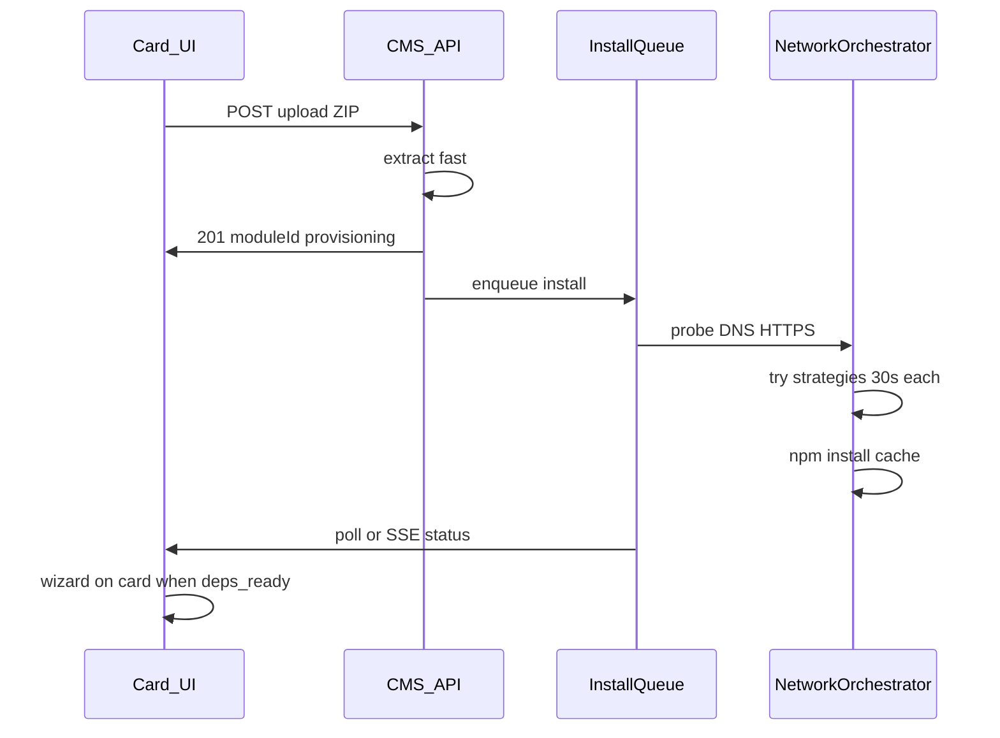

<style>
body, p, h1, h2, h3, h4, h5, h6, li, ul, ol {
    font-family: 'Segoe UI', Segoe, Tahoma, Geneva, Verdana, sans-serif !important;
    direction: rtl;
    text-align: right;
}

pre, code {
    direction: ltr;
    text-align: left;
}

table {
    direction: rtl;
    text-align: right;
    width: 100%;
    border-collapse: collapse;
    margin-inline-start: 0;
    margin-inline-end: auto;
}

thead th,
tbody td {
    text-align: right;
    vertical-align: top;
    padding: 0.35em 0.5em;
}

table td code,
table th code {
    direction: ltr;
    unicode-bidi: embed;
    text-align: left;
    display: inline-block;
}
</style>

## جمع‌بندی امکان‌سنجی

**پروپزال تو شدنی است**، ولی نه یک‌جا — باید **فازبندی** شود. با [`design.md`](d:/2 Curent project git/ModuleHub-cms/docs/design.md) §۸ و [`module-hosting-guide.md`](d:/2 Curent project git/ModuleHub-cms/docs/module-hosting-guide.md) هم‌جهت است (نصب بعد از upload، dual-WAN، کش). چیزهای جدید: **UI realtime روی کارت**، **صف نصب**، **زنجیرهٔ سیاست شبکه** — در docs فعلی نیست و باید اضافه شود.

---

## انطباق با مستندات فعلی

**هم‌خوان:**

- نصب وابستگی بلافاصله بعد از extract ZIP (قبل از wizard) — همان §۸ design.md
- `packageInstallInterface` (پیش‌فرض `enp63s0`) — [`system-settings`](d:/2 Curent project git/ModuleHub-cms/core/src/modules/system-settings/types.ts)
- `network-metric-toggler.py` — موقت metric، **در `finally` برمی‌گردد** (netplan عوض نمی‌شود)
- ماژول Static بدون `package.json` → بدون npm (تو تأیید کردی)

**شکاف با docs:**

- هیچ «کارت در حال ساخت» قبل از `wizard/save` در `site-layout.json` تعریف نشده — امروز کارت بعد از wizard در layout ظاهر می‌شود
- progress درصد آپلود و وضعیت نصب روی کارت — در `public/script.js` نیست
- timeout نصب در settings الان **۶۰۰ ثانیه** است؛ تو **۳۰ ثانیه per-attempt** می‌خواهی (متفاوت و منطقی‌تر برای «سیاست بعدی»)

---

## آیا «نخ جدا» لازم است؟

در Node معمولاً **thread جدا برای npm لازم نیست** — `npm` خودش **پروسهٔ جدا** است.

| روش | رایج؟ | توضیح |
|-----|--------|--------|
| **صف job + حد همزمانی ۱ یا ۲** | بله | نصب کارت A مابقی API را block نمی‌کند (فقط صف نصب) |
| `worker_threads` | کمتر | npm باز هم subprocess می‌خواهد؛ پیچیدگی اضافه |
| پروسهٔ جداگانهٔ CMS | اختیاری | فقط اگر بخواهی crash npm کل سرور را نزند |

**پیشنهاد:** `InstallJobQueue` با `maxConcurrentInstalls: 1` (یا ۲ روی RAM زیاد) — ساده و برای سرور تک‌نودهٔ تو کافی است.

---

## امکان‌سنجی بخش‌به‌بخش پروپزال تو

### ۱) بستن دیالوگ + نمایش realtime روی کارت

**شدنی** — با یک تغییر UX مهم:

امروز: آپلود → wizard در SweetAlert → `saveWizard` → آن وقت کارت در layout ثبت می‌شود.

برای نمایش روی کارت باید یکی از این‌ها باشد:

- **کارت موقت سمت کلاینت** (قبل از save در JSON) با `moduleId` از پاسخ upload، یا
- **ثبت زودهنگام در layout** با `status: provisioning` و نام موقت، بعد wizard همان رکورد را تکمیل کند.

**ریسک:** refresh صفحه → کارت موقت کلاینت از بین می‌رود مگر در layout ذخیره شود.  
**راه‌حل:** ثبت provisioning در layout بلافاصله بعد از upload (یک PATCH سبک).

---

### ۲) درصد پیشرفت آپلود فایل

**شدنی در مرورگر** — با `XMLHttpRequest` و `upload.onprogress` (نه `fetch` ساده).

سرور تا آخر فایل را نمی‌گیرد؛ درصد = پیشرفت **ارسال ZIP از PC به سرور**.

**ریسک:** Nginx بدون `client_max_body_size` و timeout مناسب → همان 504.  
**راه‌حل:** همان تنظیم Nginx برای `/admin/upload`.

---

### ۳) ping قبل از دانلود

**به‌جای ICMP ping** (اغلب بسته یا گمراه‌کننده برای Cloudflare):

- **HTTPS probe:** `curl -I --max-time 5` به `registry.npmjs.org`
- **DNS probe:** مقایسه IP با `8.8.8.8` vs DNS مودم (مشکل فعلی تو: IP اشتباه `185.x` vs `104.x`)

**ریسک:** ping موفق ولی npm fail (پورت 443 بسته).  
**راه‌حل:** «اعتبارسنجی اتصال» = DNS + TCP 443، نه ping.

---

### ۴) timeout ۳۰ ثانیه و بعد تغییر مسیر

**شدنی** به‌عنوان **timeout هر تلاش**، نه کل نصب:

- تلاش ۱: interface از settings، ۳۰s
- تلاش ۲: interface بعدی از لیست fallback
- تلاش ۳: registry mirror (npmmirror و …)
- تلاش ۴: DNS resolver دیگر (فقط برای همان subprocess با `env`)

**ریسک:** npm بزرگ در ۳۰s تمام نمی‌شود → false negative.  
**راه‌حل:** ۳۰s فقط برای **probe و شروع اتصال**؛ بعد از اولین بایت موفق، timeout نصب = مثلاً ۳۰۰s (از settings).

---

### ۵) تغییر metric / اینترنت — آیا سرور را مختل می‌کند؟

| روش | مختل‌کننده؟ |
|-----|-------------|
| **`network-metric-toggler` (موجود)** | خیر — فقط موقت؛ `finally` برمی‌گرداند. اگر CMS کرش کند قبل از restore → **ریسک کم** (trap + watchdog) |
| **حذف دائمی routeهای ens4** (تست قبلی ما) | بله — تا restore دستی |
| **`curl --interface enp63s0`** | فقط همان دستور — **بدون تغییر metric کل سرور** — برای probe عالی است |
| **تغییر `/etc/resolv.conf`** | نیمه‌مخرب — روی همهٔ DNS سرور اثر می‌گذارد تا برگردانی |

**پاسخ سوال تو:** بله، **بدون تغییر metric سراسری** هم می‌شود: probe با `curl --interface`؛ نصب با toggler موقت (همان کد فعلی). **حفظ تنظیم موفق برای پکیج بعدی** = ذخیره `activeStrategy` در state همان job (نه route دائمی).

**قابل انتقال به سرور دیگر:** آرایه در `system-settings.json`:

```json
"networkFallbackInterfaces": ["enp63s0", "ens4"],
"npmRegistryUrls": ["https://registry.npmjs.org/", "https://registry.npmmirror.com/"]
```

---

### ۶) حلقه سیاست + mirror + retry

**شدنی** — ماژول جدید مثلاً `install-orchestrator.ts`:

```
probe → installAttempt → onFail nextStrategy → onSuccess lockStrategy
finally → restoreRoutes + clear temp flags
```

**ریسک:** `node_modules` نیمه‌کاره بعد از fail.  
**راه‌حل:** قبل از retry همان kind: پاک کردن artifact ناقص در cache entry یا `rm -rf node_modules` در ماژول؛ npm از cache مرکزی symlink می‌زند — با hash یکسان retry هوشمند است.

**retry «مابقی پکیج‌ها»:** برای یک ماژول معمولاً یک `package.json` (یک npm) است — «چند پکیج» = چند ecosystem (npm + pip) یا چند ماژول در صف. صف جدا برای هر `moduleId` درست است.

---

### ۷) حجم دانلود روی کارت

**تا حدی شدنی:**

- از خروجی npm: سخت و ناپایدار
- از `du -sb node_modules` یا اندازه cache entry بعد از نصب: **قابل قبول**
- فاز ۱: فقط مرحله (آپلود ۴۰٪ · نصب · آماده) بدون بایت دقیق

---

### ۸) خطا روی کارت + سعی مجدد + دیالوگ لاگ

**شدنی** و با فاز ۵ CMS هم‌خوان (⚙ و لاگ):

- state روی کارت: `provisioning` / `deps_failed` / `deps_ready`
- دکمه retry → `POST /admin/module/:id/retry-dependencies`
- کلیک خطا → کد + متن فارسی + لینک `GET .../install-log`

**ریسک:** لو دادن stderr به ادمین — OK برای Super Admin.

---

## ریسک‌های اجرا و راه‌حل

**ریسک ۱ — scope بزرگ (همه‌چیز یک‌جا)**  
راه‌حل: فاز A فقط async + poll + Nginx + DNS؛ فاز B orchestrator شبکه؛ فاز C UI کارت realtime.

**ریسک ۲ — کارت قبل از wizard در layout نیست**  
راه‌حل: `status: provisioning` بلافاصله بعد از upload در JSON یا state کلاینت + sync API.

**ریسک ۳ — 504 هنوز در آپلود ZIP**  
راه‌حل: async نصب + timeout Nginx فقط برای body upload (۲–۵ دقیقه)، نه ۶۰s برای npm.

**ریسک ۴ — DNS اشتباه (ریشه مشکل فعلی)**  
راه‌حل: قبل از حلقهٔ پیچیده، fix DNS یا `npm config set registry` + resolve با DNS سالم؛ بدون این، همهٔ سیاست‌ها fail.

**ریسک ۵ — metric گیر کرده بعد از crash**  
راه‌حل: `finally` در orchestrator + اسکریپت `restore-routes.sh` + لاگ «routes restored».

**ریسک ۶ — چند نصب همزمان**  
راه‌حل: صف سراسری با concurrency=1 برای npm.

**ریسک ۷ — ۳۰s برای npm بزرگ**  
راه‌حل: ۳۰s فقط probe؛ install timeout جدا (از settings).

**ریسک ۸ — default route سیستم**  
تغییر metric موقت معمولاً default route دائمی را خراب نمی‌کند؛ با این حال نصب را در ساعات کم‌ترافیک تست کن. probe با `curl --interface` امن‌تر از حذف routeهای primary NIC است.

---

## پیشنهاد معماری (بهتر از پلن سادهٔ قبلی)



**فاز پیشنهادی:**

1. **فاز A (ضروری):** DNS/registry fix روی سرور · Nginx · async install · `GET dependency-status` · XHR progress · کارت provisioning  
2. **فاز B:** `InstallOrchestrator` (probe → fallback interfaces → mirror → restore) · retry · install-log  
3. **فاز C (اختیاری):** SSE به‌جای poll هر ۲ ثانیه · نمایش حجم واقعی

---

## پاسخ مستقیم به سوالات تو

| سوال | پاسخ |
|------|------|
| شدنی است؟ | بله، فازبندی‌شده |
| نخ جدا؟ | صف job + subprocess کافی است؛ thread اجباری نیست |
| metric سرور را مختل می‌کند؟ | toggler موقت نه؛ حذف route دائمی بله — استفاده از toggler + `curl --interface` |
| ping؟ | probe با HTTPS + DNS بهتر از ping |
| انطباق docs؟ | هستهٔ کش/dual-WAN بله؛ UI realtime و orchestrator باید به docs اضافه شود |

---

اگر موافقی، قدم بعد: **فاز A را در پلن رسمی بنویسم/اجرا کنم** (کد + یک بند در `design.md` §۸.۱). برای UI کارت realtime ترجیح می‌دهی کارت **قبل از wizard** در layout ثبت شود یا فقط **موقت در مرورگر** باشد؟

