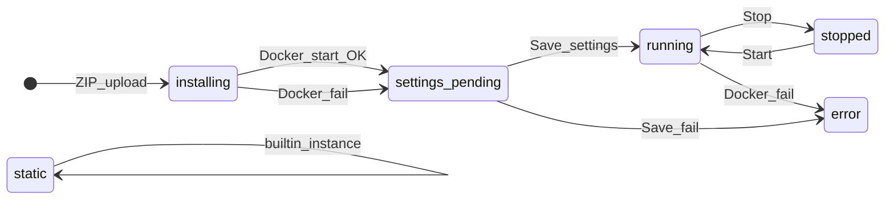

# واژگان و مالکیت فیلدها

> ملاک روایت: [proposal-simple.md](proposal-simple.md) · وضعیت کد: [current-status.md](current-status.md)

---

## ۱. انواع ماژول

| نوع | محل | ZIP | نقش |
|-----|-----|-----|-----|
| **builtin** | `core/builtin-modules/<id>/` | خیر | demo ثابت در repo (موقت تا migration catalog) |
| **catalog template** | `core/catalog-modules/<templateId>/` | خیر | قالب read-only برای Add |
| **instance** | `standalone-modules/<instanceId>/` | خیر | کپی زنده از catalog |
| **standalone** | `standalone-modules/<moduleId>/` | ✅ | ZIP + Docker |

---

## ۲. شناسه‌ها

| نام | کاربرد |
|-----|--------|
| `templateId` | کلید قالب در catalog (مثلاً `image-gallery`) |
| `instanceId` | شناسه instance زنده — کاربر یا `sanitizeModuleId(cardTitle)` |
| `moduleId` | **کلید canonical در `modules.json`** — برای ZIP = `sanitizeModuleId(manifest.name)` |

قانون: `moduleId` === `instanceId` برای instanceهای catalog؛ برای ZIP از نام manifest ساخته می‌شود.

---

## ۳. Lifecycle (state machine)

| State | معنی |
|-------|------|
| `installing` | ZIP extract + Docker در حال بالا آمدن |
| `settings_pending` | منتظر Save Settings |
| `running` | proxy فعال (standalone) |
| `stopped` | کانتینر down؛ landing روی host |
| `static` | builtin / instance بدون Docker |
| `error` | خطای Docker یا settings |

⛔ `Approve` + Start دستی — جریان قدیمی؛ جایگزین: settings flow (P2b). API `/approve` deprecated (P5a).

---

## ۴. مالکیت فیلدها

| فیلد / مفهوم | فایل منبع |
|--------------|-----------|
| `title`, `subtitle`, `icon`, `iconClass`, `route`, `folderId`, `sortOrder` | `site-layout.json` |
| `status`, `hostPort`, `containerId`, `installPath`, `type` | `modules.json` |
| `docker`, `proxy`, `github`, `entryHtml`, `modulePasswordHash` | `manifest.json` |
| card image URL | `site-layout.items[].icon` (نه manifest) |
| module password (hash) | `manifest.modulePasswordHash` |
| `hasModulePassword` (API view) | مشتق — hash برنمی‌گردد |

---

## ۵. سه فایل JSON

| فایل | نقش |
|------|-----|
| `site-layout.json` | presentation + navigation (پوشه مجازی، کارت‌ها) |
| `modules.json` | runtime state (status، Docker metadata) |
| `manifest.json` | قرارداد ماژول روی دیسک instance |

Schema: layout → `SiteLayoutSchema` (Zod) · modules → `ModuleRegistrySchema` (P5d)

